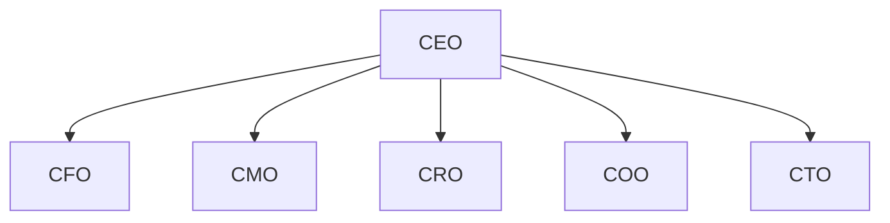

# Roles

```mermaid
flowchart TD
  ceo["CEO"] --> cfo["CFO"]
  ceo --> cmo["CMO"]
  ceo --> cro["CRO"]
  ceo --> coo["COO"]
  ceo --> cto["CTO"]
```

Each box is a [role](/people/roles/index.md); who holds it is on the role's
page. Keep this diagram in step with each role's `reports_to`.
